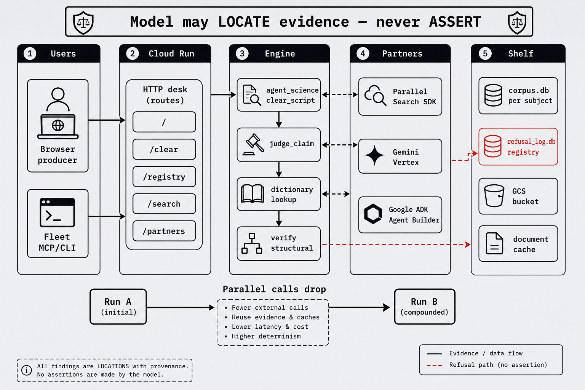
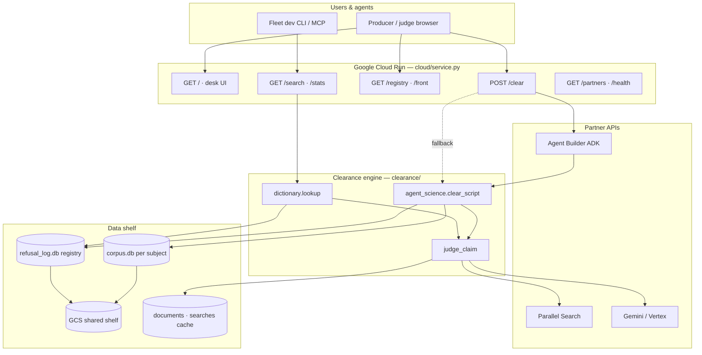
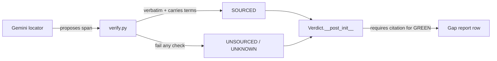
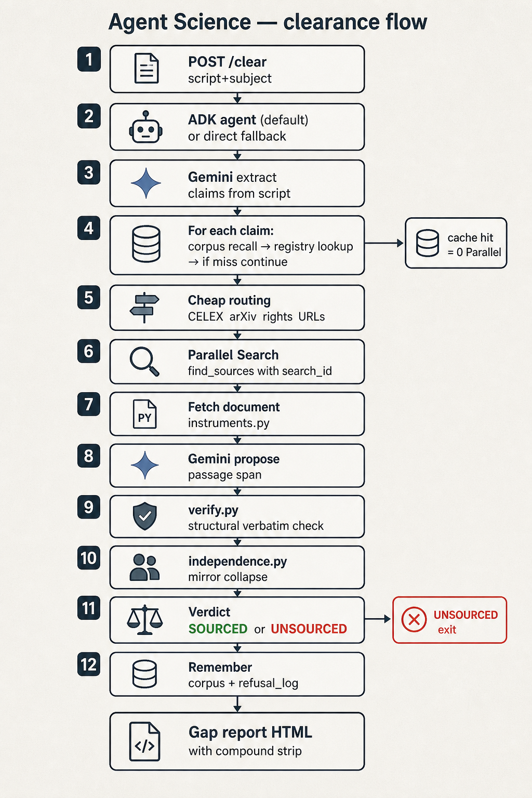
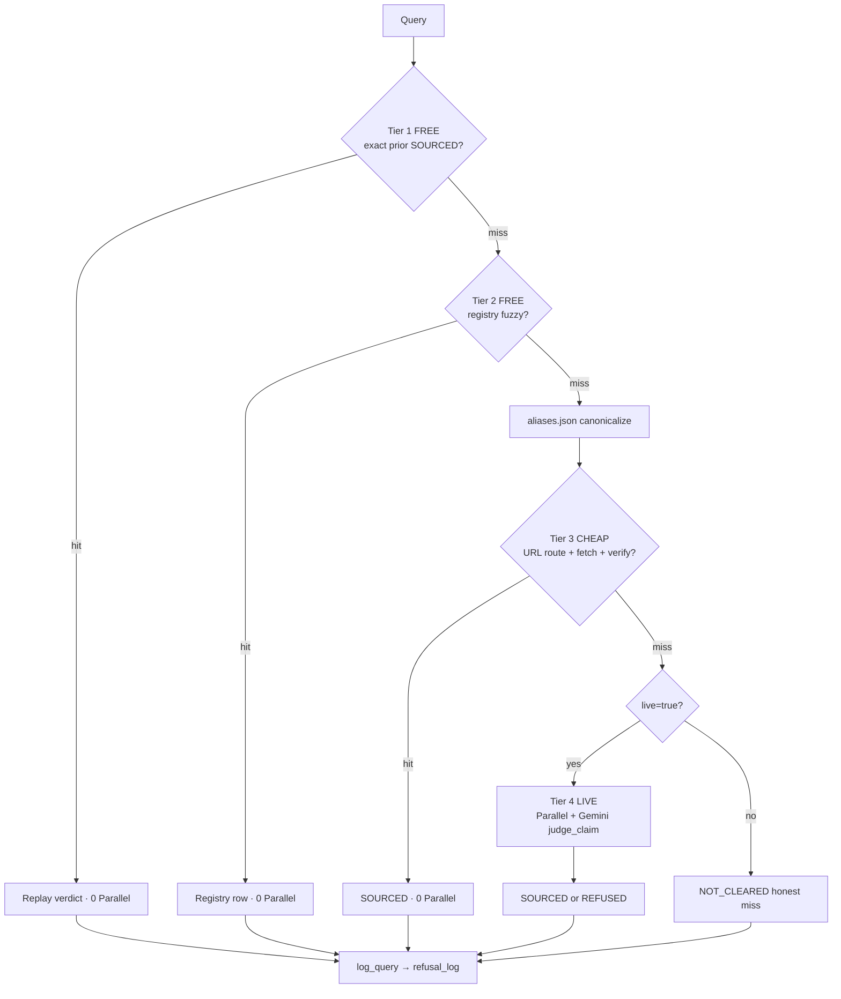
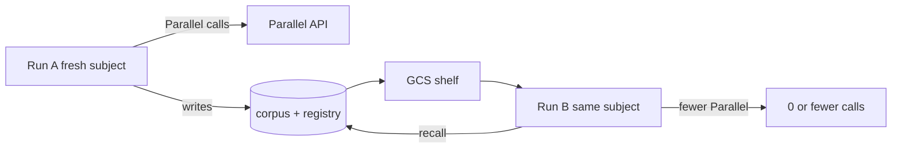
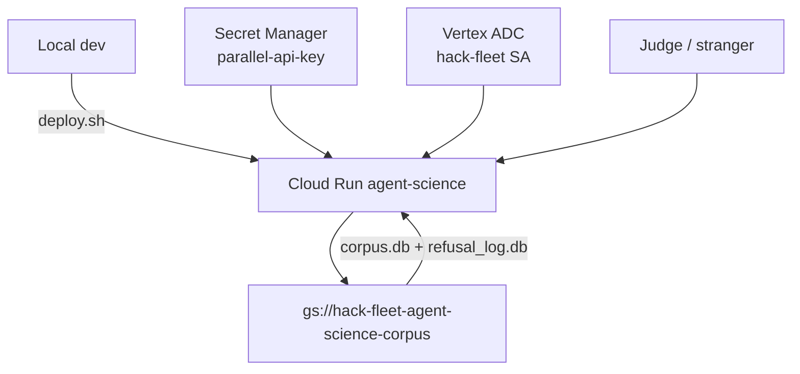

# Architecture — Agent Science

**Hosted:** https://agent-science-568004190078.us-central1.run.app  
**Visual index:** [assets/README.md](./assets/README.md) · **Status:** [STATUS.md](./STATUS.md)



Agent Science is a **clearance desk** and **truth dictionary** for documentary production. You paste narration; every checkable claim comes back **SOURCED** (verbatim quote from a fetched document) or **UNSOURCED** (named refusal). A model may only **locate** evidence — never assert it.

---

## System overview



---

## The one rule (design invariant)



- **Locator** (`clearance/gemini.py`, `clearance/locate.py`) — untrusted; swappable.
- **Verifier** (`clearance/verify.py`, `clearance/semantic.py`) — structural; provider-independent.
- **Verdict** (`clearance/verdict.py`) — constructor rejects GREEN without citation + quoted terms.

---

## Flow 1 — Script clearance (`POST /clear`)



The default path on Cloud Run runs through **ADK**; on failure it falls back to the **direct** pipeline and stamps `engine` in the response.

```mermaid
sequenceDiagram
    participant Browser
    participant Service as cloud/service.py
    participant ADK as cloud/agent.py
    participant AS as agent_science.py
    participant Corp as corpus.db
    participant Log as refusal_log.db
    participant Facts as facts.judge_claim
    participant Par as Parallel
    participant Gem as Gemini

    Browser->>Service: POST /clear {script, subject}
    Service->>ADK: run_clearance() [default]
    ADK->>AS: clear_script_tool → clear_script()
    loop each extracted claim
        AS->>Corp: recall(subject, claim)
        alt same-subject memory
            Corp-->>AS: cached verdict
        else cross-subject registry
            AS->>Log: lookup(claim)
            Log-->>AS: prior SOURCED/REFUSED
        else live judge
            AS->>Facts: judge_claim(live_search=true)
            Facts->>Par: find_sources() [if no routed URL]
            Facts->>Gem: extract/locate passages
            Facts->>Facts: verify() structural
            Facts-->>AS: Verdict
            AS->>Corp: remember()
            AS->>Log: record()
        end
    end
    AS-->>Service: gap report JSON
    Service-->>Browser: HTML memo or JSON
```

### Per-claim judge pipeline (`clearance/facts.py`)

| Step | Module | What happens |
|------|--------|----------------|
| 1 | `routing.py` | Cheap primary URLs — CELEX, arXiv, rights vocab (no Parallel) |
| 2 | `search.py` | Parallel `parallel-web` SDK — candidate URLs + `search_id` receipt |
| 3 | `instruments.py` | Fetch document body → `cache/documents.json` |
| 4 | `gemini.py` | Propose candidate spans in fetched body |
| 5 | `verify.py` | Verbatim + term coverage + statement shape |
| 6 | `independence.py` | Collapse mirrors; demote non-primary sources |
| 7 | `verdict.py` | Stamp SOURCED / UNSOURCED with cause code |

---

## Flow 2 — Truth dictionary lookup

Fleet research should route through Agent Science instead of raw web search (`AGENTS.md`).



**Surfaces:**

| Surface | Entry | Module |
|---------|-------|--------|
| MCP tool | `science_lookup` | `clearance/mcp_server.py` |
| HTTP | `GET/POST /search` | `stack_search.search()` → `dictionary.lookup()` |
| CLI | `python3 -m clearance search` | `clearance/stack_cli.py` |

**Cost tiers** stamped on every response: `free` · `cheap` · `live`.

---

## Flow 3 — Registry & compounding

Two memory layers:

| Store | Scope | File | Purpose |
|-------|-------|------|---------|
| **Corpus** | Per production (`subject`) | `corpus.db` | Same script re-run; same subject A→B |
| **Refusal log** | Cross-production fleet | `refusal_log.db` | Truth dictionary; `/registry` browse |



**Compound metrics** in gap report: `parallel_api_calls`, `corpus_hits`, `log_hits` — measured on hosted URL (sealed prediction: A=1 → B=0 Parallel).

---

## HTTP surface map

| Route | Type | Purpose |
|-------|------|---------|
| `/` | HTML | Clearance desk — paste script |
| `POST /clear` | HTML or JSON | Gap report / memo |
| `/front` | HTML | Wedge exhibit — refusals as product |
| `/registry` | HTML | Browsable sourced + refused claims |
| `/registry/api?q=` | JSON | Registry search |
| `/refusal?term=` | HTML | Audit trail for one refusal |
| `/popular/ui` | HTML | Dev query analytics + alias candidates |
| `/search` | JSON | Stack websearch (dictionary tiers) |
| `/stats` | JSON | Hit rate, query log economics |
| `/health` | JSON | Partner liveness + `engine_default` |
| `/partners` | JSON | Track manifest for judges |
| `/corpus?subject=` | JSON | Subject shelf stats |

Screenshots: [`assets/screens/`](./assets/screens/)

---

## Partner integrations

```mermaid
flowchart TB
    subgraph Track["Parallel track checklist"]
        P1[Parallel Search at runtime]
        P2[Gemini at runtime]
        P3[Cloud Run hosted]
        P4[ADK default engine]
    end

    P1 --> search.py
    P2 --> gemini.py + extract.py
    P3 --> service.py + corpus_gcs.py
    P4 --> agent.py

    search.py -->|parallel-web 1.3.2| API1[api.parallel.ai]
    gemini.py -->|Vertex ADC| API2[Vertex Gemini]
    agent.py -->|google-adk 2.7.1| API3[Agent Builder]
```

| Partner | Module | Proof |
|---------|--------|-------|
| Parallel | `clearance/search.py` | `/health.parallel_sdk`, `search_receipts.jsonl` |
| Gemini | `clearance/gemini.py` | `/health.gemini_path` |
| Cloud Run | `cloud/service.py`, `deploy.sh` | Hosted URL, GCS URIs |
| ADK | `cloud/agent.py` | `engine: "adk"` on `/clear` |

Detail: [PARTNER-INTEGRATIONS-2026-08-30.md](./PARTNER-INTEGRATIONS-2026-08-30.md) · [PARTNER-INTEGRATION-RESEARCH-2026-08-31.md](./PARTNER-INTEGRATION-RESEARCH-2026-08-31.md)

---

## Module map

```
cleared/
├── agent_science.py          # clear_script() orchestrator
├── ask_registry.py           # registry HTML renderers
├── cloud/
│   ├── service.py            # HTTP desk (all routes)
│   ├── agent.py              # ADK default /clear path
│   └── partners.py           # /partners manifest
├── clearance/
│   ├── facts.py              # judge_claim — core pipeline
│   ├── dictionary.py         # truth dictionary tiers
│   ├── search.py             # Parallel integration
│   ├── gemini.py             # extract + locate
│   ├── verify.py             # structural proof
│   ├── corpus.py             # per-subject memory
│   ├── refusal_log.py        # fleet registry
│   ├── stack_search.py       # HTTP/CLI search wrapper
│   └── mcp_server.py         # Cursor MCP tools
├── truth-dictionary/
│   └── aliases.json          # canonical query keys
└── cache/                    # gitignored runtime shelf
    ├── corpus.db
    ├── refusal_log.db
    ├── documents.json
    └── search_receipts.jsonl
```

---

## Deploy topology



---

## Related docs

| Doc | Contents |
|-----|----------|
| [VISION-2026-08.md](../VISION-2026-08.md) | Product vision |
| [AGENTS.md](../AGENTS.md) | Fleet routing policy |
| [hack.md](../hack.md) | Hackathon constitution + gates |
| [assets/README.md](./assets/README.md) | Diagrams + screenshot index |
